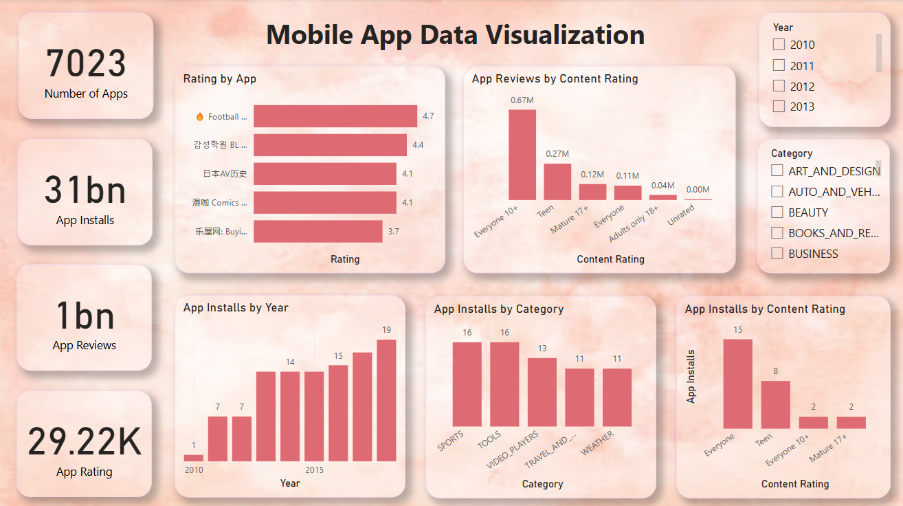

# 📱 Mobile App Data Analysis Dashboard (Power BI)

## 📌 Project Overview

This Power BI dashboard analyzes mobile application data to understand app performance, installs, ratings, and category distribution.

The dashboard provides insights into app popularity, content ratings, and installation trends over time.

## 🎯 Objectives

* Analyze app installs across different categories
* Study app ratings and review patterns
* Explore install trends over different years
* Understand app distribution based on content rating

## 📊 Key Metrics

* Total Apps: 7023
* Total Installs: 31 Billion
* Total App Reviews: 1 Billion
* Average App Rating: 29.22K

## 📈 Key Insights

* Sports and Tools categories have the highest number of installs.
* Apps rated for **Everyone** have the largest install base.
* App installs increased steadily across the years.
* Some apps have significantly higher ratings compared to others.

## 📊 Visualizations Used

* KPI Cards
* Bar Charts
* Category Analysis
* Year Filter
* Content Rating Distribution

## 🛠 Tools Used

* Power BI
* Data Visualization
* Data Analysis

## 📷 Dashboard Preview

## 📂 Dataset

Mobile application dataset containing:

* App category
* Ratings
* Reviews
* Installs
* Content rating
* App release year
